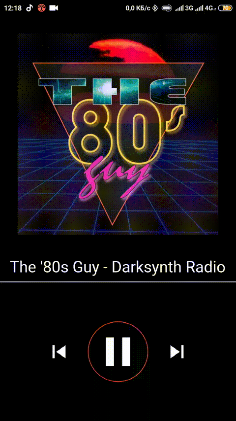

# Radio Player

## General Information

Radio Player allows you to listen to several livestreams.

### - Project uses Clean Architecture approach
### - Project uses Cubit for navigation purposes

## App Demo

| Station change animation: | Play/pause animation: | 
| --- | --- |
|  |  |

## Features:

- Supports both iOS and Android.
- Can work in background.
- Push-notification with media control buttons.
    - Can also be controlled with your headgear's media control buttons.

## Flutter Plugins Used[^1]:

[^1]: Plugins' versions can be found
at "[this link](pubspec.yaml)"

- android_power_manager
- audio_session
- audio_service
- connectivity
- fluttertoast
- just_audio
- http
- equatable
- flutter_bloc
